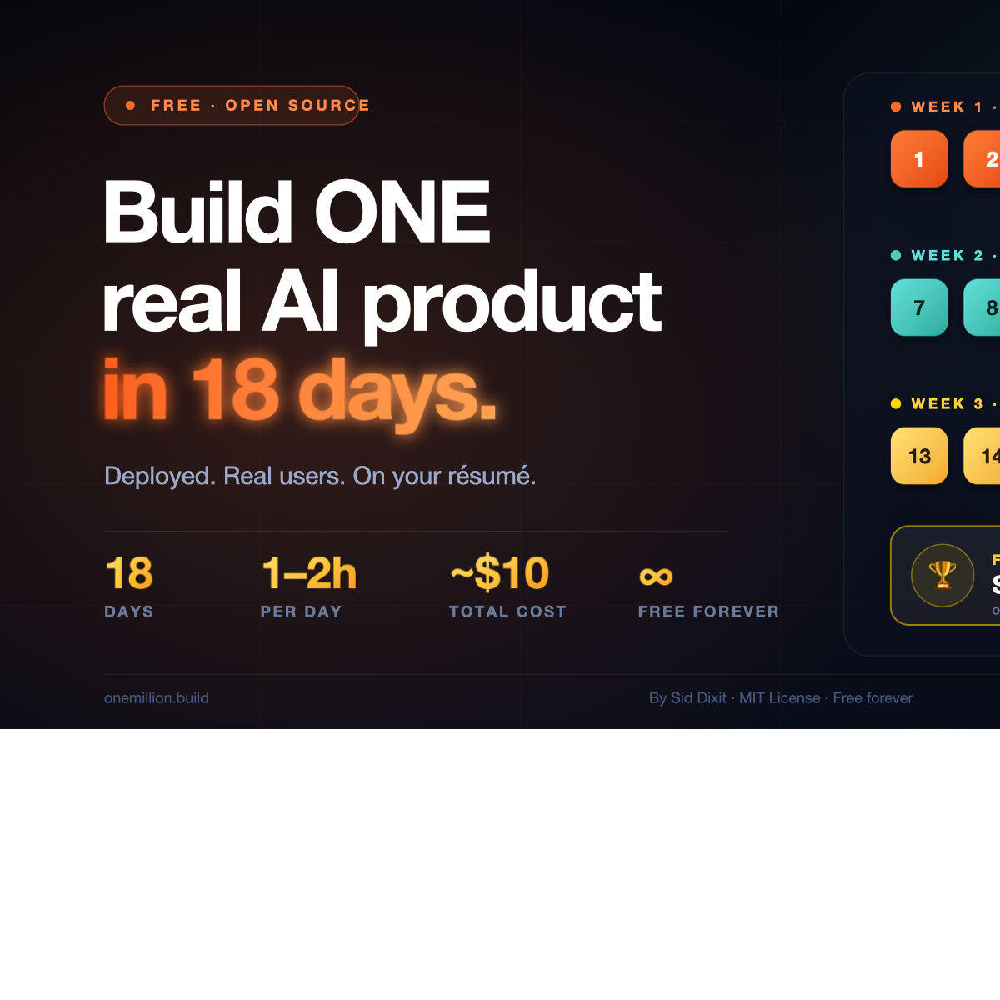
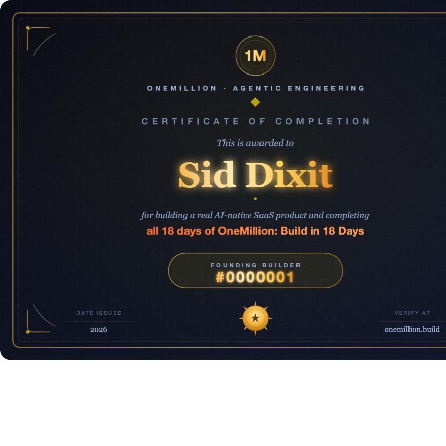

# 🚀 OneMillion: Build in 18 Days

*Created by [Sid Dixit](https://linkedin.com/in/siddharthdixit)*

---

You've probably seen the headlines: solo founders shipping SaaS in days, indie builders launching real AI products from their laptops, people who never wrote code five months ago now running real businesses. You try to copy it. Three hours in, you're debugging a system you don't understand.

**This course fixes that.**

- **18 days, one phase at a time.** No information overload. Build one thing each day and understand it before moving on.
- **1–2 hours per day.** Honest time bands — engineers go faster, EAs go slower. Both finish on Day 18.
- **A real shipped product, no team required.** By Day 18 you have a live URL, real auth, a working AI feature, and real users. Total cost: ~$10 in AI credits.
- **Use AI to learn AI.** Your AI tool (Claude Code, Cursor, Antigravity — your choice) reads the course files and helps you ship. You're the director.

&nbsp;

## 🎓 Get Certified — Become a Builder

Complete all 18 days and pass all 18 verifications → receive **Builder #N**. Sequential, permanent, public. Listed forever at [onemillion.build/builders](builders/README.md).

🎁 First 100 builders ever get **Founding Builder** status: permanent badge + Sid's personal Slack + intro to one investor or hiring manager on graduation.

Apply for the next cohort: [cohort/README.md](cohort/README.md)

---

## 💡 How It Works

- **Five files per day.** `learn.md` (concept), `build.md` (step-by-step), `ai-instructions-day-XX.md` (paste into your AI to verify your work), `loom.md` (Sid walks you through it), `resources.md` (go deeper).
- **Read the learn, follow the build, run the verifier.** Pass all 18 verifiers → claim your Builder number.
- **Your AI builds with you.** Each build includes prompts you paste into Claude Code (or Cursor, or any AI tool). It writes the code. You direct + review + ship.
- **Transferable.** The framework (spec before code, multi-agent decomposition, validation gates, production hygiene, human review loop) applies to any product you build after.

---

## 📚 Course Days

| Day | What You Build |
|-----|----------------|
| [Day 0: Public Commitment](day-0-commit/README.md) | A LinkedIn post — doubles your odds of finishing |
| [Day 1: Vision + Mental Map](week-1-foundation/day-01-vision/learn.md) | A picked product type + idea + a live URL with your name |
| [Day 2: Problem + Mom Test](week-1-foundation/day-02-problem/learn.md) | 3 real conversations + evidence-backed pain |
| [Day 3: Write Your PRD](week-1-foundation/day-03-prd/learn.md) | Locked PRD with 5 sections + exactly 3 features |
| [Day 4: Stack + First Deploy](week-1-foundation/day-04-stack/learn.md) | A real Next.js app deployed at your-app.vercel.app |
| [Day 5: Auth + Database](week-1-foundation/day-05-auth/learn.md) | Signup → login working with Row Level Security |
| [Day 6: Core Feature](week-1-foundation/day-06-core-feature/learn.md) | Your main feature working end-to-end, live |
| [Day 7: AI Feature Spec](week-2-make-it-ai/day-07-ai-spec/learn.md) | Locked AI spec with measurable quality criteria |
| [Day 8: First AI Call](week-2-make-it-ai/day-08-first-ai-call/learn.md) | Real Claude output flowing into your app |
| [Day 9: Streaming UI](week-2-make-it-ai/day-09-streaming/learn.md) | Tokens appearing live in your UI |
| [Day 10: Tool Use](week-2-make-it-ai/day-10-tool-use/learn.md) | AI takes real actions in your database |
| [Day 11: RAG](week-2-make-it-ai/day-11-rag/learn.md) | AI personalized to your user's actual data |
| [Day 12: Lock the AI](week-2-make-it-ai/day-12-lock-the-ai/learn.md) | Acceptance tests + cost budget + hard rate limit |
| [Day 13: Production Hygiene](week-3-ship-and-sell/day-13-hygiene/learn.md) | 9-point audit — secrets, RLS, rate limits |
| [Day 14: Custom Domain](week-3-ship-and-sell/day-14-domain/learn.md) | yourapp.com live with automatic SSL |
| [Day 15: Monitoring](week-3-ship-and-sell/day-15-monitoring/learn.md) | Sentry + Vercel Analytics + UptimeRobot |
| [Day 16: Landing Page](week-3-ship-and-sell/day-16-landing/learn.md) | Real landing page at root URL |
| [Day 17: First 10 Users](week-3-ship-and-sell/day-17-first-users/learn.md) | At least 1 real user + feedback documented |
| [Day 18: Demo Day → Builder #N](week-3-ship-and-sell/day-18-demo/learn.md) | 5-min Loom + your Builder number |

---

## 🏆 What You Walk Away With

- A **live SaaS at yourapp.com** (or .vercel.app — also fine)
- A **GitHub repo** with 18 days of commits — proof you built it
- A **Builder number** — Builder #N — sequential and permanent
- A **public profile** at onemillion.build/builders/[your-number]
- A **LinkedIn badge** with verifiable credential
- The ability to **build any product, anytime, from scratch — for the rest of your life**

---

## 🚀 Who This Course Is For

- **Executive Assistants** who've never opened a terminal
- **Product Managers** who've shipped specs but never built a product end-to-end
- **Engineers** who want to master agentic SDLC and the new way of building
- **Yoga teachers, nurses, designers, retirees, career-changers** — yes, all of you

Zero prior experience required. If you can use Google Docs, you can do this.

---

## 🛠️ What You Need to Start

- **A laptop** (Mac, Windows, or Linux)
- **An Anthropic API key** ([here's how to get one](getting-your-api-key.md)) — ~$10 in credits covers the full course
- **An AI tool of your choice** — Claude Code, Cursor, Antigravity, Windsurf, or any AI chat ([pick yours](tools/README.md))

Total setup time: ~30–60 minutes ([getting-started.md](getting-started.md)).

---

## 🛡️ You'll Miss Days. That's Normal.

The 18 days are units of progress, not calendar days. Skip a day, take a week off, come back when life lets you. **No shame, no streaks, no badges taken away.** Builder #N gets earned when you finish — not by when you finish.

The only way to fail is to never come back.

---

## 🗓️ Live Cohorts

Sid runs free weekend-based cohorts every 6–8 weeks. Saturday live session + 1 hr/day self-paced. 20–100 builders per cohort. Demo Day on the final Saturday.

→ Apply for the next cohort: [cohort/README.md](cohort/README.md)

🎁 First 100 builders ever get permanent Founding Builder status.

---

## ❓ FAQ

Have questions about cost, time, what if I fall behind, what AI tool to use? [Read the FAQ](FAQ.md).

---

## 🔗 Related

- [The Manifesto: The Age of Agentic Engineering](MANIFESTO.md) — why this exists
- [Cost Transparency](cost-transparency.md) — full $0–25 breakdown
- [Best OneMillion Resources](best-onemillion-resources.md) — after-course exploration
- [How verification works](verify/README.md) — how Builder #N is earned
- [Builder Wall](builders/README.md) — public profiles of past graduates

---

## 💬 Share the Love

If you finished the course, please share it. Tag [Sid Dixit](https://linkedin.com/in/siddharthdixit) on LinkedIn with #BuildingWith1M and let him know what you built. It makes his day. It also helps the next Builder find the course.

---

## 📄 License

MIT. Free to use, fork, remix, and share. If you build on this, please credit OneMillion and link back to this repo.

---

**Happy building. 🚀**

→ **[Start with Day 0](day-0-commit/README.md)**
